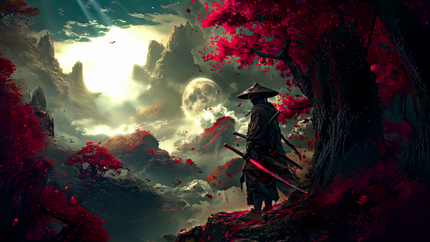
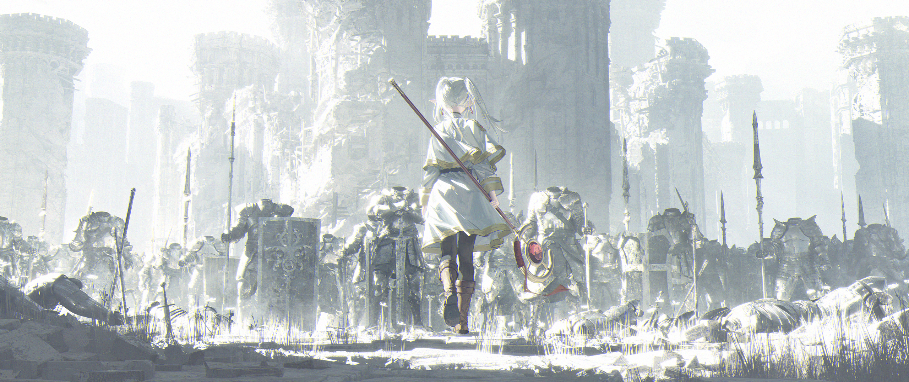
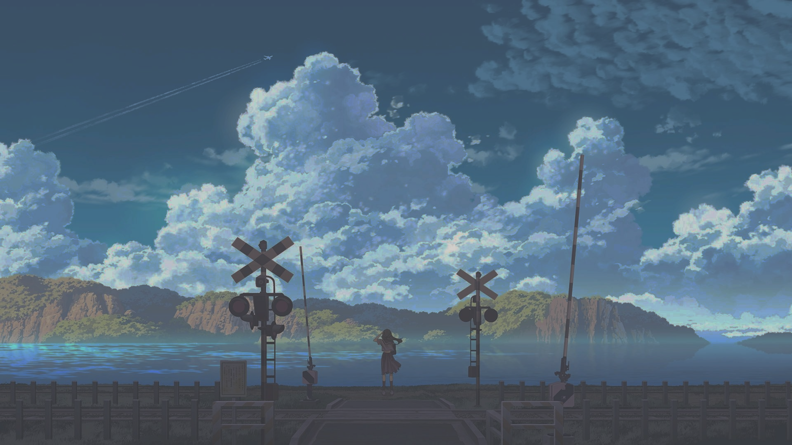
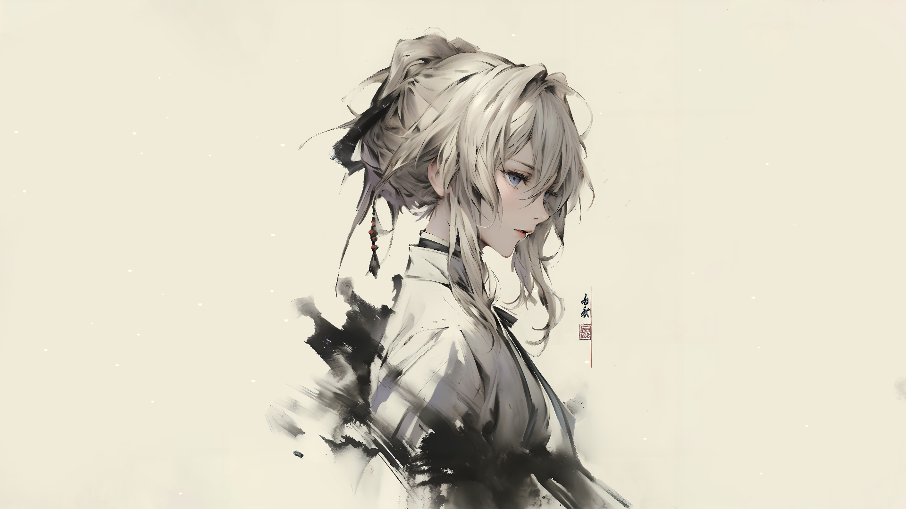
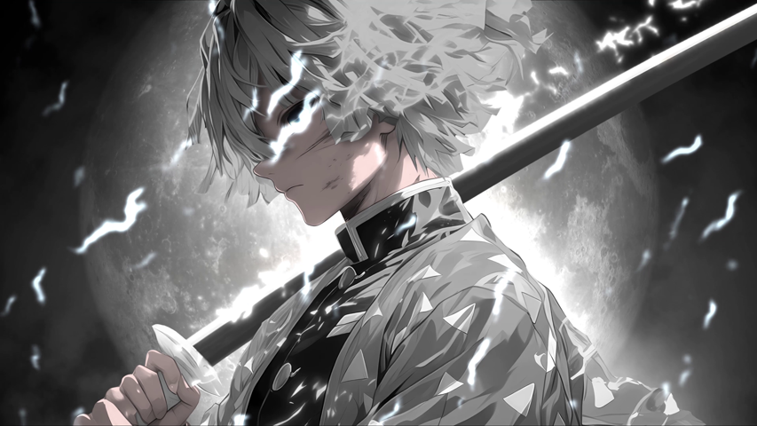
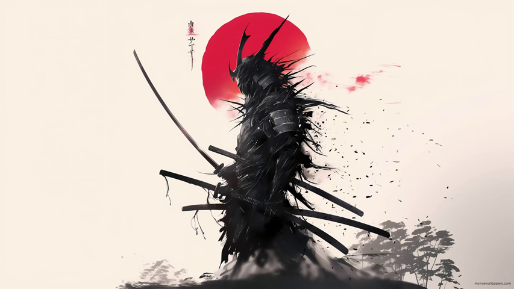

# Bloom Wallpapers 🌸🎨

<p align="center">
  <a href="https://github.com/Yato-Works/Bloom"><strong>← Back to Bloom Desktop Shell</strong></a>
</p>

> **A curated collection of aesthetic anime, scenic, and vibrant wallpapers hand-picked for [Bloom](https://github.com/Yato-Works/Bloom).**  
> *"Personally selected favorites that make Material You color extraction and CAVA audio visualizers truly bloom."*

<p align="center">
  
  
  
</p>

---

## 💬 Message from the Creator / 作者より

作者が普段愛用している壁紙の中から、**[Bloom](https://github.com/Yato-Works/Bloom) の Material You カラー抽出エンジンや CAVA オーディオスペクトラムが最高に美しく映えるお気に入りの 12 枚** を厳選しました！

Bloom の公式スクリーンショットで使用しているメイン壁紙（`Day_Samurai.png`）をはじめ、サイバーパンク調の夜景、朝焼けの街並み、アニメ調の美麗なアートワークなど、僕の好みが全開ですが（笑）、どれも色鮮やかで Bloom のすりガラス UI と抜群に調和します。

ぜひお好きな壁紙をダウンロードして、Windows デスクトップのカスタマイズをお楽しみください！

> *These are my personal favorite desktop wallpapers, carefully chosen because their color palettes pair exquisitely with Bloom's dynamic Material You theme generation and reactive CAVA audio spectrums. Feel free to use, mix, and customize them!*

---

## 🖼️ Wallpaper Gallery / 収録壁紙一覧

| Preview | Name | Theme & Palette Notes |
|:---:|:---|:---|
|  | **Day Samurai** 🌸 *(Official Hero)* | Bloom 公式スクショ採用壁紙。淡いピンクと紫の桜吹雪が Material You パレットを可憐に染め上げます。 |
|  | **City Morning** ☀️ | 朝焼けに染まる街と澄んだスカイブルー。明るく爽やかなデスクトップ体験に最適。 |
|  | **Cyber Neon** 🌆 | サイバーパンクなネオン街。ディープダークモードと鮮やかなシアン・マゼンタのコントラスト。 |
|  | **Frieren Journey** 🍃 | 柔らかな光と緑が広がるファンタジー風景。落ち着いたアーストーンの UI を生成。 |
|  | **Train Stop Sunset** 🌇 | 夕暮れの駅ホーム。ノスタルジックなオレンジとインディゴのグラデーション。 |
|  | **Violet Horizon** 🌊 | 息を呑むような大空と広大な水面。透明感あふれるペールブルーとエメラルド。 |
|  | **Noragami Yato** ⚔️ *(Yato-Works)* | Yato-Works のルーツである夜ト。コントラストの高いシャープな青と黒。 |
|  | **Yato Portrait** 🌌 | 夜空を背景にした夜トの肖像。ミッドナイトブルーと月光の陰影。 |
|  | **Anime Showdown** ⚡ | 躍動感あふれるバトルシーン。高彩度なエフェクトが CAVA イコライザーと強烈にシンクロ。 |
|  | **White Zenitsu** ⚡ | モノトーンの背景に閃光が走るハイコントラストデザイン。ミニマル志向にぴったり。 |
|  | **Crimson Clover** 🔥 | 燃え盛る真紅のエネルギーとダークシャドウ。重厚で力強いデスクトップへ。 |
|  | **Samurai Silhouette** 🌙 | 月夜に佇む侍のシルエット。墨絵のような落ち着きと静寂を演出。 |

---

## 🛠️ How to Use with Bloom / Bloom での使い方

1. このリポジトリをクローンまたは ZIP でダウンロードします：
   ```powershell
   git clone https://github.com/Yato-Works/Bloom_Wallpapers.git
   ```
2. 壁紙画像を、お使いの PC の以下のいずれかのフォルダに配置します：
   - `%USERPROFILE%\Pictures\Bloom-Wallpapers` （ピクチャ フォルダ内）
   - `%USERPROFILE%\Documents\Bloom-Wallpapers` （ドキュメント フォルダ内）
   - または Bloom 実行ファイルと同じディレクトリの `wallpapers\` フォルダ
3. **Bloom** を起動し、画面下端へマウスをホバーするか `Ctrl + Win` でランチャーを呼び出します。
4. `>wallpaper` と入力して Enter を押すと、横スクロールのカルーセルに壁紙が即座に表示されます。
5. クリックするだけで Windows の壁紙が切り替わり、Material You テーマカラーが自動抽出されます！

---

## 📜 Disclaimer & Credits

収録されている画像は、個人利用およびデスクトップのカスタマイズ（Ricing）を目的として収集・選定されたものです。各画像の著作権はそれぞれの原作者・イラストレーターに帰属します。商業利用はお控えいただき、個人の非商用デスクトップ体験としてお楽しみください。
